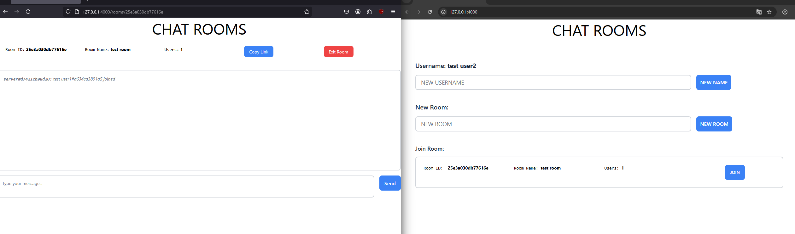
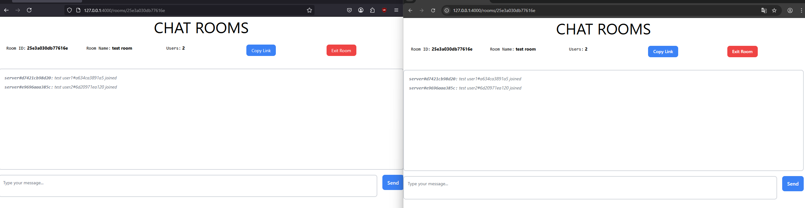
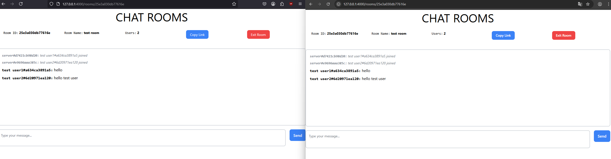

# Chat Rooms

Minimalistic chat rooms where you can set username, open rooms and chat temporarily.

## ⚠️ Important Note

**Please wait 1-2 minutes after the website loads!** The WebSocket connection takes time to establish. You'll see "WebSocket connection: Success" in the browser console when it's ready. The chat functionality will work once the connection is established.

## 📝 Project Disclaimer

**This is a simple project to try out Elixir and Phoenix framework.** Everything is stored in memory with no encryption and no security guarantees. This project was created for educational purposes to explore real-time web applications with Phoenix WebChannels.


## Tech Stack
- **Elixir** ~> 1.14
- **Phoenix** ~> 1.7.21 & Phoenix WebChannels
- **HTML, JavaScript, TailwindCSS**
- **Docker** (optional)

## 🐳 Docker (Recommended)

### Basic Version (Local Access)
```bash
# Build the Docker image
docker build -t chat-rooms .

# Run the container
docker run -p 4000:4000 chat-rooms
```

Access at: **http://localhost:4000**

### With Public Tunneling (WebSocket Compatible)
```bash
# Build with free tunneling (Cloudflare Tunnel)
docker build -f Dockerfile.tunnel-free -t chat-rooms-tunnel .

# Run with public access
docker run -p 4000:4000 chat-rooms-tunnel
```

This provides **full WebSocket support** using [Cloudflare Tunnel](https://github.com/cloudflare/cloudflared) and displays the public URL in the console!

**Expected Console Output:**
```
🚀 Starting Chat Rooms with Cloudflare Tunnel...

Starting Phoenix server...
Starting Cloudflare Tunnel...
Creating public tunnel with full WebSocket support...
Your public URL will appear below:
Note: Cloudflare Tunnel provides excellent WebSocket support!

+----------------------------------------------------------------------------------+
|  Your quick Tunnel has been created! Visit it at (it may take some time to be  |
|  ready):                                                                         |
|  https://abc123-def456.trycloudflare.com                                        |
+----------------------------------------------------------------------------------+
```

**⚠️ Important Note:** Cloudflare Tunnel is a free service that may change or become unavailable. If the tunnel fails to start, you can use alternative tunneling services like [ngrok](https://ngrok.com/) or alternatives ... or deploy to cloud platforms like Railway, Fly.io, or Heroku.

### Create and Load Docker Image for Other Machines

#### Create the image file:
```bash
# Build the image first
docker build -t chat-rooms .

# Save the image to a tar file
docker save chat-rooms:latest -o chat-rooms-docker-image.tar
```

#### Load and run on another machine:
```bash
# Load the pre-built image (copy the .tar file to the target machine first)
docker load -i chat-rooms-docker-image.tar

# Run the container
docker run -p 4000:4000 chat-rooms:latest
```

Access at: **http://localhost:4000**

## 💻 Manual Installation

### Requirements
- **Elixir** ~> 1.14 (requires Erlang/OTP 25+)
- **Erlang/OTP** 25 or higher
- **Node.js** 16+ (for building assets)
- **Mix** (comes with Elixir)
- **Git** (for cloning)

### Setup
```bash
git clone https://github.com/levo-777/chat_rooms.git
cd chat_rooms/server
mix deps.get
mix phx.server
```

Access at: **http://localhost:4000**

### Version Check Commands
```bash
# Check Elixir version
elixir --version

# Check Erlang version
erl -eval 'erlang:display(erlang:system_info(otp_release)), halt().'

# Check Node.js version
node --version
```

## 🚀 Features

- **Real-time Chat**: Phoenix WebChannels for instant messaging
- **Room Management**: Create, join, and leave chat rooms
- **User System**: Set custom usernames
- **Temporary Rooms**: Rooms exist only while users are active
- **WebSocket Support**: Full real-time communication

## 📸 Screenshots





## 🌐 Making it Public

**Note:** To make your chat rooms publicly accessible, you can use tunneling services like ngrok (`ngrok http 4000`) or deploy to cloud platforms like Railway, Fly.io, or Heroku. For public hosting, set the `PHX_HOST` environment variable to your domain (e.g., `PHX_HOST=yourdomain.com`). WebSocket connections should work automatically with most tunneling services and cloud platforms.

## 🔧 Troubleshooting

### WebSocket Connection Issues
- Wait 1-2 minutes after page load
- Check browser console for "WebSocket connection: Success"
- Refresh the page if connection fails
- **For public hosting**: Set `PHX_HOST=yourdomain.com` environment variable
- **For tunneling**: WebSocket connections work automatically with ngrok and similar services
- **URL mismatch**: Check browser console for WebSocket connection errors
- **CORS issues**: Most tunneling services handle this automatically

### Docker Issues
- Ensure port 4000 is not in use: `docker ps`
- Stop conflicting containers: `docker stop $(docker ps -q)`

### Manual Installation Issues
- Ensure Elixir 1.14+ is installed: `elixir --version`
- Check Erlang version: `erl -eval 'erlang:display(erlang:system_info(otp_release)), halt().'`
- Verify Node.js is installed: `node --version`

## 📦 File Sizes

- **Docker Image**: ~250MB (compressed)
- **Source Code**: ~50MB
- **Dependencies**: ~200MB (first build only)

## 🎯 Quick Start

**Fastest way to get started:**
```bash
docker build -t chat-rooms . && docker run -p 4000:4000 chat-rooms
```

Then open **http://localhost:4000** and wait 1-2 minutes for the WebSocket connection to establish!
